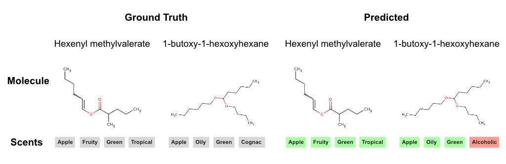
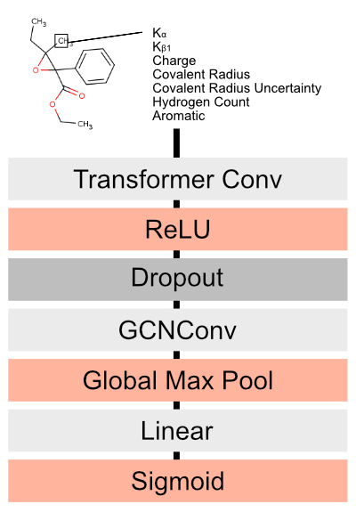

# Multilabel Molecule Scent Classification

## About

We leverage a GNN architecture to classify molecule scent using the [Leffingwell Odor Dataset](https://zenodo.org/record/4085098#.Y0ozoOzMKrM). This project was largely inspired by some of Alex Wiltschko's work at Google Brain, In particular, I was inspired by [his lecture at MIT](https://www.youtube.com/watch?v=Z5Pw5eWItiw). I went on to read [the paper referenced in the lecture](https://arxiv.org/pdf/1910.10685.pdf) but couldn't find a published implementation. So I decided to learn about graph neural networks and implement something similar.

## Architecture

### Data

We leverage the [Leffingwell Odor Dataset](https://zenodo.org/record/4085098#.Y0ozoOzMKrM) which contains **3522 molecules** and 113 scents whereby a single molecule may have multiple scents assigned. 

We filter the 20 most common scents by occurence. The data is severly imbalanced with respect to each class. 

The frequency of each class is as follows. Note that each scent may be on the same molecule.

**scent**|**freq**
:-----:|:-----:
fruity|1391
green|907
sweet|825
floral|553
fatty|407
herbal|406
sulfurous|252
waxy|244
apple|239
fresh|237
nutty|224
meaty|218
woody|211
spicy|203
citrus|201
tropical|201
oily|200
roasted|195
ethereal|194
winey|174

### Model

We utilize a 10-layer TransformerConv architecture as depicted in Figure 1. The model is trained for 300 epochs using Binary Cross Entropy loss and the Adam optimizer with an initial learning rate of 0.0001, with a decrease in learning rate by a constant factor of 0.1 every 100 epochs. 

Due to the imbalanced dataset, we construct balanced mini-batches using the Pytorch WeighetdRandomSampler.

## Results

We achieve the following performance on the test dataset.

**class**|**precision**|**recall**|**TP**|**FP**|**TN**|**FN**
:-----:|:-----:|:-----:|:-----:|:-----:|:-----:|:-----:
fruity|0.762590|0.623529|106|33|149|64
green|0.648352|0.424460|59|32|181|80
sweet|0.361905|0.431818|38|67|197|50
floral|0.509091|0.411765|28|27|257|40
fatty|0.543478|0.543478|25|21|285|21
herbal|0.342857|0.307692|12|23|290|27
sulfurous|0.807692|0.600000|21|5|312|14
waxy|0.586207|0.340000|17|12|290|33
apple|0.652174|0.340909|15|8|300|29
fresh|0.380952|0.195122|8|13|298|33
nutty|0.555556|0.319149|15|12|293|32
meaty|0.850000|0.425000|17|3|309|23
woody|0.263158|0.263158|5|14|319|14
spicy|0.444444|0.228571|8|10|307|27
citrus|0.833333|0.375000|15|3|309|25
tropical|0.636364|0.411765|14|8|310|20
oily|0.444444|0.571429|12|15|316|9
roasted|0.590909|0.325000|13|9|303|27
ethereal|0.550000|0.440000|11|9|318|14
winey|0.250000|0.166667|4|12|316|20

We achieve the following performance on the training dataset.

**class**|**precision**|**recall**|**TP**|**FP**|**TN**|**FN**
:-----:|:-----:|:-----:|:-----:|:-----:|:-----:|:-----:
fruity|0.885370|0.820423|1398|181|1285|306
green|0.828918|0.783822|1095|226|1547|302
sweet|0.682641|0.752347|641|298|2020|211
floral|0.677333|0.763910|508|242|2263|157
fatty|0.796586|0.720721|560|143|2250|217
herbal|0.558140|0.785276|384|304|2377|105
sulfurous|0.990291|0.829268|204|2|2922|42
waxy|0.781022|0.666667|428|120|2408|214
apple|0.789610|0.787565|304|81|2703|82
fresh|0.738791|0.681655|379|134|2480|177
nutty|0.836676|0.834286|292|57|2763|58
meaty|0.917647|0.790541|234|21|2853|62
woody|0.613514|0.774744|227|143|2734|66
spicy|0.805970|0.827586|216|52|2857|45
citrus|0.854991|0.774744|454|77|2507|132
tropical|0.769697|0.749263|254|76|2755|85
oily|0.660508|0.742857|286|147|2638|99
roasted|0.886139|0.696498|179|23|2890|78
ethereal|0.828571|0.671815|174|36|2875|85
winey|0.774347|0.718062|326|95|2621|128

## Interpretation

**TODO.** There's limited use in being able to semi-accurately classify a molecule's scent profile. What is truly valuable is understanding why a molecule smells the way that it does. This will form the basis for furthering our understanding how we interpret taste and how we can build artificial taste receptors.

## Next Steps

Model interpretation. Model scale-up.
